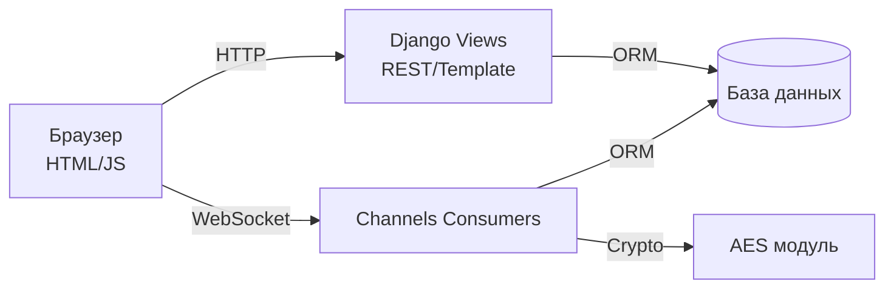

# Commex — приватный мессенджер для быстрого обмена сообщениями

Commex — это веб‑клиент, который сочетает привычные чаты и защищённые сообщения. Пользователи могут регистрироваться, находить собеседников, создавать диалоги и общаться в реальном времени через WebSocket, а содержимое сообщений шифруется и хранится в базе данных только в зашифрованном виде.

Сервер построен на Django и Channels, поэтому обеспечивает как классические HTTP‑страницы, так и долговременные WebSocket‑соединения. Интерфейс адаптирован под десктоп и использует Bootstrap, чтобы можно было мгновенно ориентироваться в списке чатов и окне диалога.

## Features
- Регистрация и авторизация пользователей с загрузкой аватара.
- Список доступных чатов и быстрый поиск собеседников.
- Создание приватных диалогов и обмен сообщениями в реальном времени.
- Шифрование текста сообщений (AES) перед сохранением в БД.
- Индикация доставки и прочтения (двойные галочки) с live‑обновлением.
- Удаление сообщений и целых чатов с подтверждением действия.

## Tech Stack
- **Backend:** Python 3, Django, Django Channels, ASGI.
- **Realtime:** WebSocket через Channels, Redis/Channels Layer.
- **Database:** SQLite (по умолчанию) или другая поддерживаемая Django СУБД.
- **Frontend:** Django Templates, Bootstrap 5, JavaScript (ES6).
- **Crypto:** кастомный AES‑модуль для шифрования содержимого сообщений.

## Installation
1. **Клонируйте репозиторий**
   ```bash
   git clone https://github.com/<your-org>/CommexProject.git
   cd CommexProject
   ```
2. **Создайте виртуальное окружение**
   ```bash
   python3 -m venv .venv
   source .venv/bin/activate  # Windows: .venv\Scripts\activate
   ```
3. **Установите зависимости**
   ```bash
   pip install --upgrade pip
   pip install -r requirements.txt
   ```
4. **Примените миграции**
   ```bash
   python manage.py migrate
   ```
5. **Создайте суперпользователя (опционально для админки)**
   ```bash
   python manage.py createsuperuser
   ```
6. **Запустите сервер разработки**
   ```bash
   python manage.py runserver
   ```
7. **Откройте приложение**
   - Перейдите в браузере по адресу `http://127.0.0.1:8000/`
   - Создайте новый аккаунт или войдите под суперпользователем.

> Для корректной работы WebSocket потребуется настроенный Channels Layer (например, Redis). Локально можно использовать встроенный InMemoryChannelLayer, но для production обязательно разверните Redis и пропишите настройки в `settings.py`.

## Архитектурная схема



