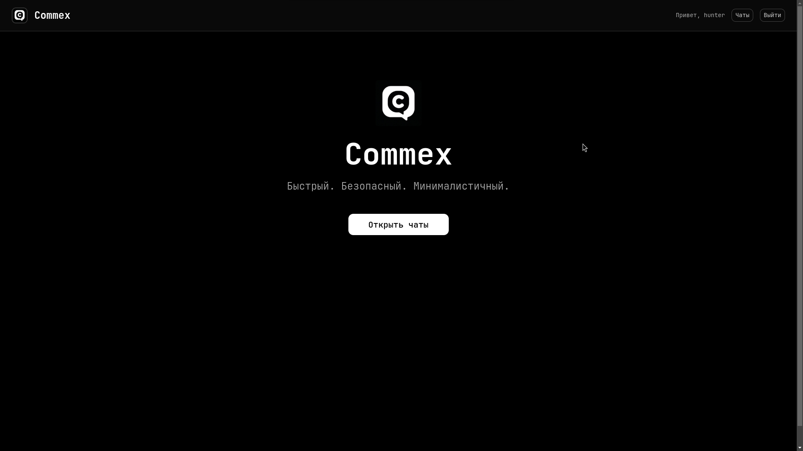
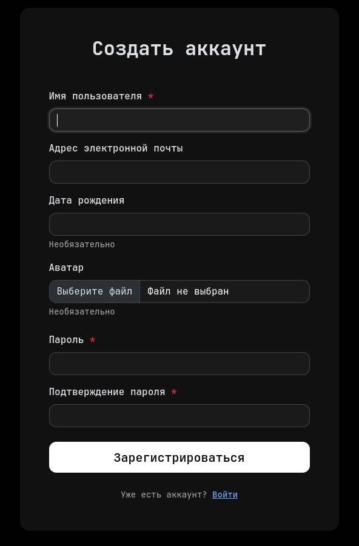
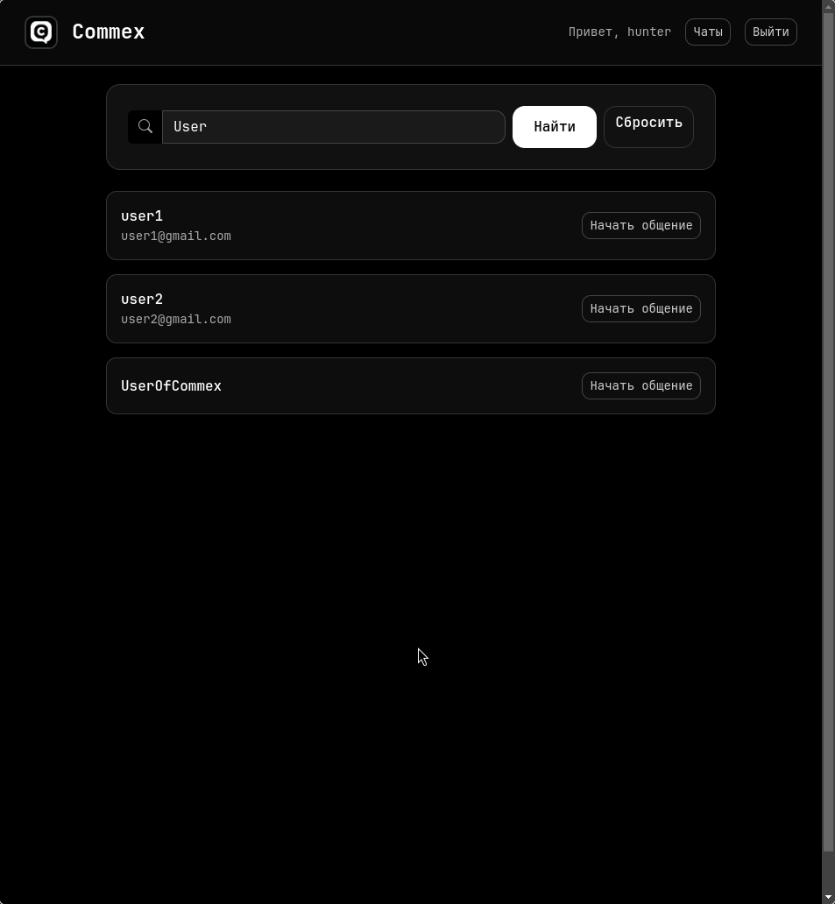
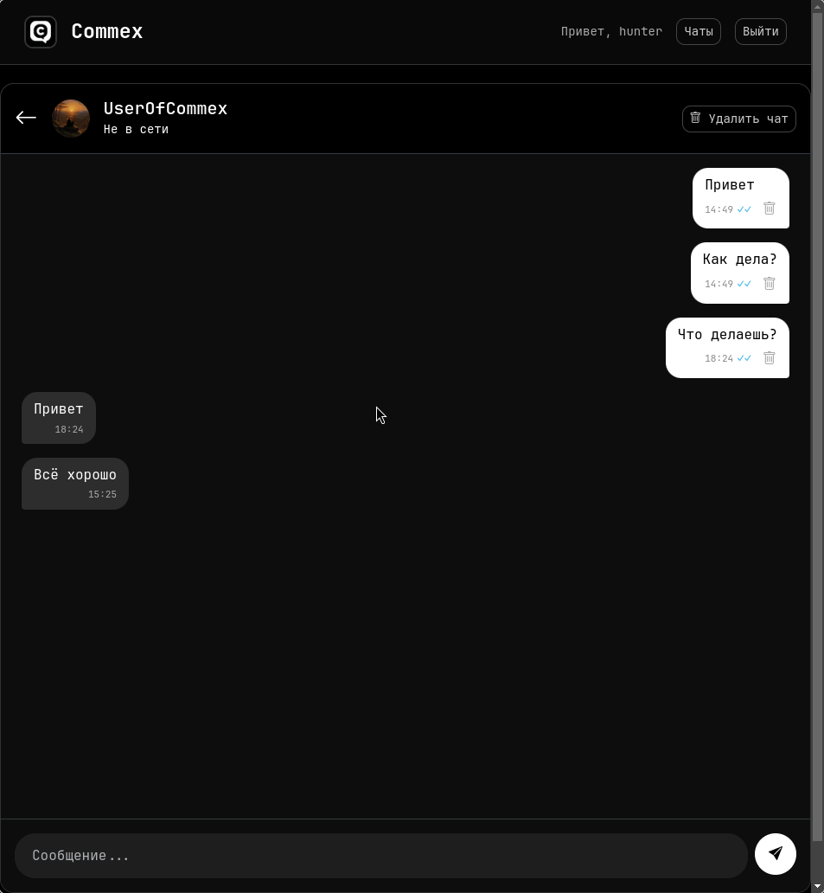
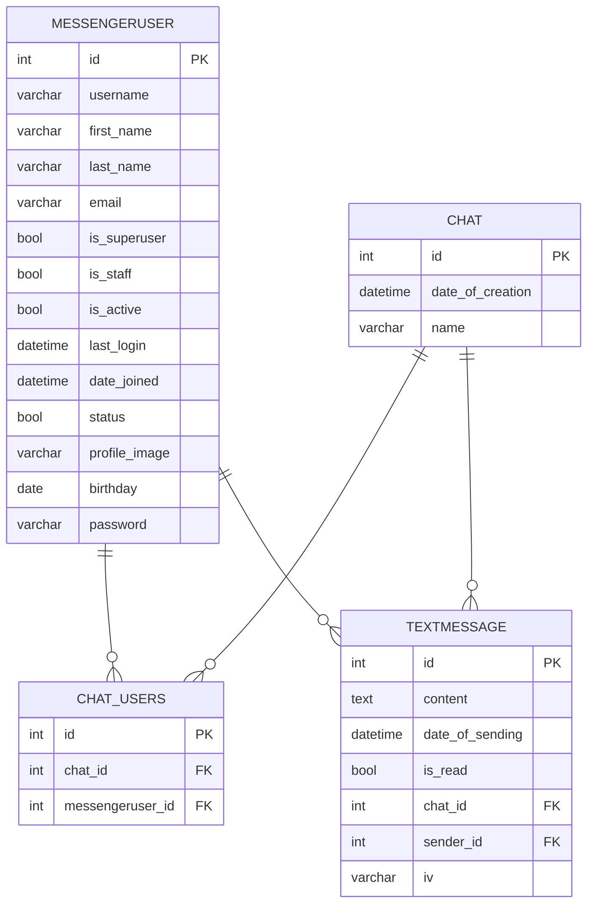
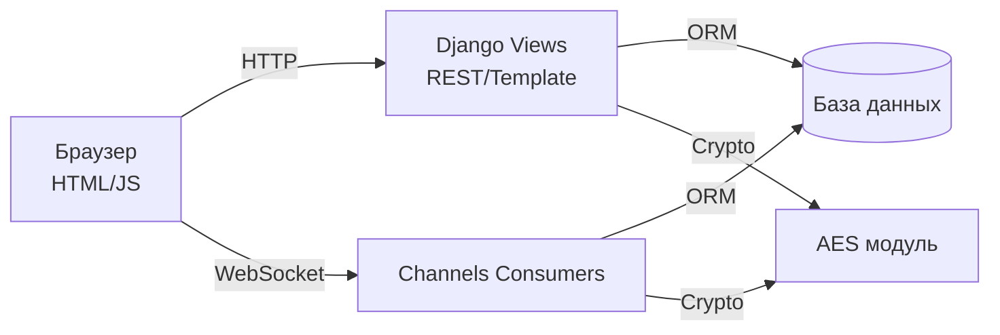

# Commex
**Commex** — это веб-приложение, мессенджер. Пользователи могут регистрироваться, находить собеседников, создавать диалоги и общаться в реальном времени.

Сервер построен на Django и Channels, поэтому обеспечивает как классические HTTP‑страницы, так и долговременные WebSocket‑соединения. 

## Функции
- Регистрация и авторизация пользователей с загрузкой аватара.
- Список доступных чатов и поиск собеседников.
- Создание приватных диалогов и обмен сообщениями в реальном времени.
- Шифрование текста сообщений перед сохранением в БД.
- Удаление сообщений и целых чатов с подтверждением действия.

## Стек технологий
- **Backend:** Python 3, Django, Django Channels.
- **Database:** SQLite
- **Frontend:** HTML, CSS, Bootstrap 5, JavaScript.

## Установка
1. **Клонируйте репозиторий**
   ```bash
   git clone https://github.com/HunterXIII/CommexProject
   cd CommexProject
   ```
2. **Создайте виртуальное окружение**
   ```bash
   python3 -m venv .venv
   source .venv/bin/activate  
   ```
3. **Установите зависимости**
   ```bash
   pip install -r requirements.txt
   ```
4. **Примените миграции**
   ```bash
   python manage.py migrate
   ```
5. **Для работы WebSocket потребуется Redis.**
> Его также необходимо установить и запустить 

6. **Создайте суперпользователя (опционально для админки)**
   ```bash
   python manage.py createsuperuser
   ```
7. **Запустите сервер разработки**
   ```bash
   python manage.py runserver
   ```
8. **Откройте приложение**
   - Перейдите в браузере по адресу `http://127.0.0.1:8000/`
   - Создайте новый аккаунт или войдите под суперпользователем.

## Скриншоты
- Главная

- Регистрации

- Поиск

- Чат


## Схема базы данных


## Архитектурная схема



